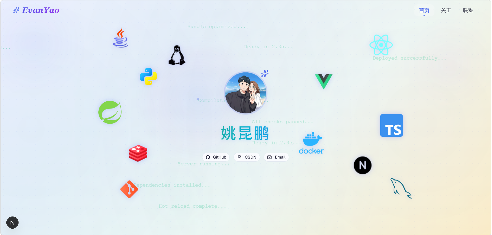

# Evan Yao — 个人作品集

个人数字空间 & 技术作品集，展示项目经历、技术栈和成长故事。如果这个项目对你有所启发，欢迎参考与借鉴。

**在线预览:** [evanyao826324.vercel.app](https://evanyao826324.vercel.app)

## 截图



## 技术栈

Next.js 16 · TypeScript · React 19 · Tailwind CSS 4 · shadcn/ui · Framer Motion · Vercel

## 页面

| 路由 | 说明 |
|------|------|
| `/` | Hero 首页 — 头像、社交链接、浮动科技图标、成功消息动画 |
| `/about` | 关于我 — 个人介绍、成长时间线、Bento Grid、技术栈、人生哲学、未来规划 |
| `/contact` | 联系方式 — Email / GitHub / CSDN / 简历下载 / 所在地 / 当前状态 |

## 本地开发

```bash
npm install
npm run dev
```

打开 [http://localhost:3000](http://localhost:3000) 查看。

## 开源协议

MIT
